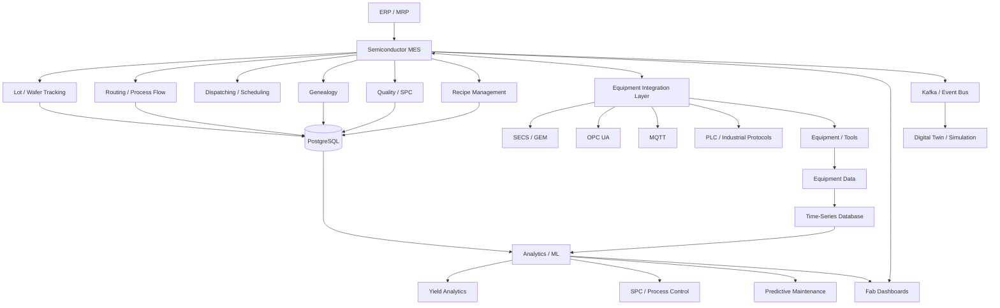

# Awesome-Semiconductor-Manufacturing-Execution-System

## Top Semiconductor Manufacturing Execution System (MES) Ecosystem

**Curated List of SaaS/Hosted Platforms & Open-Source GitHub Projects**
*Focused on Semiconductor MES, Fab Automation, Lot/wafer Tracking, Genealogy, Yield, Quality, Equipment Integration & Smart Manufacturing*
**Last updated: September 2026**

This repository tracks notable **SaaS/Hosted platforms** and **open-source projects** for **Semiconductor Manufacturing Execution Systems (MES)**. These systems manage production execution across semiconductor fabs, including lot and wafer tracking, routing, recipes, equipment integration, material control, genealogy, quality, yield, dispatching, production scheduling, SPC, maintenance, traceability and factory automation.

**Examples** include Siemens Opcenter Execution Semiconductor, Camstar MES, Critical Manufacturing MES, Applied Materials SmartFactory, ABB Ability MES, GE Vernova Proficy MES, Rockwell FactoryTalk ProductionCentre/MES, Parsec TrakSYS, 42Q, and FORCAM FORCE MES. Siemens specifically positions Opcenter Execution Semiconductor around semiconductor production operations, throughput, yield, cost, equipment connectivity, traceability, quality and production digital twins. ([Siemens][1])

**Open-source emphasis**: This section is heavily expanded with open-source MES, manufacturing-management, ERP/MRP, production-tracking, IoT, OPC UA, MQTT, SECS/GEM, SPC, quality, genealogy, scheduling, workflow and analytics projects. The open-source semiconductor-MES ecosystem is much smaller than the commercial semiconductor-MES market, so the most realistic approach is generally to combine an open-source MES foundation with **equipment connectivity + semiconductor protocols + databases + SPC/yield analytics + automation**.

**Important:** Projects such as **OpenMES, qcadoo MES, ERPNext, Odoo Community, WebErpMesv2 and Salbotics SSD-Line MES** are useful open-source manufacturing-execution foundations, but most are **not complete semiconductor-fab MES replacements** for Opcenter Semiconductor or Camstar. OpenMES, for example, explicitly describes itself as an open-source ISA-95-oriented MES with production planning, work orders, quality checks, downtime tracking, MQTT connectivity and ERP integration. ([GitHub][2])

Contributions welcome! Open a PR to add/update entries. Keep descriptions factual and link to official sites or GitHub repositories.

## Table of Contents

* [SaaS/Hosted Platforms](#saashosted-platforms)
* [Open-Source GitHub Projects](#open-source-github-projects)
* [Open-Source MES Platforms](#open-source-mes-platforms)
* [Open-Source ERP/MRP Platforms with MES Capabilities](#open-source-erpmrp-platforms-with-mes-capabilities)
* [Open-Source Semiconductor Equipment Connectivity](#open-source-semiconductor-equipment-connectivity)
* [Open-Source Manufacturing IoT & Automation](#open-source-manufacturing-iot--automation)
* [Open-Source SPC, Quality & Yield](#open-source-spc-quality--yield)
* [Open-Source Scheduling & Production Optimization](#open-source-scheduling--production-optimization)
* [Open-Source Data & Analytics](#open-source-data--analytics)
* [Additional Strong Open-Source Options](#additional-strong-open-source-options)
* [Commercial Semiconductor MES → Open-Source Equivalents](#commercial-semiconductor-mes--open-source-equivalents)
* [Frameworks for Building Custom Semiconductor MES](#frameworks-for-building-custom-semiconductor-mes)
* [Reference Semiconductor MES Architecture](#reference-semiconductor-mes-architecture)
* [Typical Semiconductor MES Workflow](#typical-semiconductor-mes-workflow)
* [How to Contribute](#how-to-contribute)
* [Disclaimer](#disclaimer)

## SaaS/Hosted Platforms

| Platform Name | Capabilities & Description | Starting Pricing | Free Tier / Trial Limits |
| :--- | :--- | :--- | :--- |
| **Siemens Opcenter Execution Semiconductor** | Semiconductor-specific MES covering production execution, throughput, yield, cost, equipment connectivity, quality, traceability, scheduling and digital-twin-enabled optimization. ([Siemens][1]) | Starts at $1,000/mo (entry cloud modules); $75,000/yr enterprise base | 30-day free trial via Siemens Opcenter preconfigured cloud sandbox environment |
| **Siemens Opcenter Execution / Camstar** | Enterprise MES platform with strong semiconductor, electronics and discrete-manufacturing capabilities, including manufacturing workflows, genealogy, quality and production management. | Starts at $1,000/mo (scheduling/execution modules); $50,000/yr enterprise base | 30-day free trial for Opcenter Scheduling Standard cloud sandbox |
| **Critical Manufacturing MES** | Modern MES platform with a strong focus on semiconductor and electronics manufacturing, equipment integration, production tracking, genealogy, quality, scheduling and Industry 4.0. | Starts at $2,500/mo per line (ScaleUp subscription program); $60,000/yr base | 30-day evaluation trial via Early Adopter sandbox program |
| **Applied Materials SmartFactory** | Semiconductor-factory automation and manufacturing intelligence ecosystem integrating equipment, factory data, process control, analytics and production optimization. | Starts at $5,000/mo (process control/analytics); $100,000/yr enterprise suite | 30-day guided POC cloud trial environment for enterprise evaluations |
| **ABB Ability MES** | Manufacturing execution and production-management capabilities integrated into ABB's industrial digitalization ecosystem. | Starts at $1,500/mo for entry plant subscriptions on ABB Ability Marketplace | 30-day free trial on selected ABB Ability Marketplace condition-monitoring modules |
| **GE Vernova Proficy MES** | Enterprise manufacturing execution platform covering production management, quality, performance, traceability, workflow and plant-floor integration. | Starts at $1,500/mo subscription tier ($5,000 base module license) | 30-day evaluation trial with 2-hour continuous runtime demo resets |
| **Rockwell Automation FactoryTalk ProductionCentre / MES** | Manufacturing execution and production-management ecosystem integrated with Rockwell Automation's FactoryTalk and industrial automation portfolio. | Starts at $2,000/mo subscription tier ($15,000 base server + $250/user/mo) | 30-day hands-on lab environment trial via Rockwell Cloud Demo Portal |
| **Parsec TrakSYS** | Manufacturing operations management/MES platform covering production, quality, performance, downtime, traceability and plant-floor data collection. | Starts at $1,999/mo (Essentials tier; up to $15,999+/mo Ultimate tier) | 14-day interactive sandbox trial with pre-loaded sample plant datasets |
| **42Q** | Cloud-native manufacturing execution and manufacturing-data platform designed for connected manufacturing operations and distributed production environments. | Starts at $500/mo per facility ($1,500/mo standard multi-line tier) | 90-day fixed-cost Proof of Concept (POC) trial (includes 30-day free sandbox) |
| **FORCAM FORCE MES** | Manufacturing execution and performance-management platform focused on shop-floor transparency, OEE, production performance, machine connectivity and continuous improvement. | Starts at $1,200/mo per plant connector package ($15,000/yr platform base) | 30-day guided cloud evaluation trial for plant connectivity & OEE |
| **Honeywell Manufacturing Execution Systems** | Industrial manufacturing execution and process-management technologies supporting production, quality, process control and operational data. | Starts at $2,500/mo per plant site subscription tier ($40,000/yr base) | 30-day evaluation trial in Honeywell Experion/MES cloud sandbox |
| **Dassault Systèmes DELMIA Apriso** | Global manufacturing operations management/MES platform covering production, quality, warehouse, maintenance and supply-chain execution. | Starts at $3,500/mo per plant subscription ($50,000/yr base MOM license) | 30-day virtual sandbox trial access for enterprise evaluation teams |
| **AVEVA Manufacturing Execution System** | MES/MOM capabilities integrating production execution, operations, quality, performance and industrial data. | Starts at $1,800/mo via AVEVA Flex subscription units ($25,000/yr base) | 30-day evaluation trial with sample project templates in AVEVA Connect |
| **Körber Werum PAS-X** | Manufacturing execution platform widely used in regulated manufacturing and increasingly relevant to complex production traceability and electronic batch/process execution. | Starts at $4,000/mo for cloud-based PAS-X Lite starting tier ($60,000/yr base) | 30-day preconfigured cloud sandbox trial for batch/recipe execution |
| **SAP Digital Manufacturing** | Cloud manufacturing execution and operations platform connecting ERP, production processes, shop-floor data, quality and analytics. | Starts at $105/resource/mo (Entry tier starting at 30 resources; ~$3,150/mo base) | 30-day test tenant subscription via SAP Store evaluation sandbox |
| **Honeywell Momentum** | Manufacturing operations/MES technology supporting production and operational execution in industrial environments. | Starts at $2,000/mo subscription tier ($24,000/yr base platform) | 30-day guided cloud trial environment with pre-built data pipelines |

## Open-Source GitHub Projects

* **[OpenMES](https://github.com/Mes-Open/OpenMes)**
  Open-source, self-hosted MES focused on production planning, work orders, batches, quality checks, downtime, production tracking, MQTT machine connectivity and ERP integration. It explicitly maps its architecture to ISA-95/IEC 62264 Level 3. ([GitHub][2])

* **[qcadoo MES](https://github.com/qcadoo/MES)**
  Mature open-source MES/manufacturing-management project with production planning and execution capabilities. The community version is AGPLv3 licensed. ([GitHub][3])

* **[Salbotics SSD-Line MES](https://github.com/SaladinIART/salbotics-ssd-mes)**
  Small open-source reference MES written in C#/.NET with routing, track-in/track-out, genealogy, yield, SQL persistence and API/dashboard capabilities. Its example production flow is specifically based on SSD manufacturing, making it particularly interesting for semiconductor-MES experimentation. ([GitHub][4])

* **[WebErpMesv2](https://github.com/SMEWebify/WebErpMesv2)**
  Open-source manufacturing ERP/MES-oriented application for production-resource management, manufacturing execution and shop-floor operations. It appears among current GitHub manufacturing-execution projects. ([GitHub][5])

* **[ERPNext](https://github.com/frappe/erpnext)**
  Open-source ERP with manufacturing capabilities including production planning, BOMs, work orders, material consumption, capacity planning and inventory. Useful as an ERP/MRP layer underneath a custom semiconductor MES. ([GitHub][6])

* **[Odoo Community](https://github.com/odoo/odoo)**
  Open-source ERP platform with manufacturing functionality that can provide work orders, BOMs, routings, inventory, maintenance and production-management foundations.

* **[OCA Manufacturing](https://github.com/OCA/manufacture)**
  Large community collection of Odoo manufacturing extensions covering MRP, production operations and related manufacturing functions. The repository is AGPL-3.0. ([GitHub][7])

### Additional Strong Open-Source MES Options

* **[OpenMES](https://github.com/Mes-Open/OpenMes)** — modern open-source MES with ISA-95 orientation.
* **[qcadoo MES](https://github.com/qcadoo/MES)** — established open-source MES.
* **[Salbotics SSD-Line MES](https://github.com/SaladinIART/salbotics-ssd-mes)** — semiconductor-oriented MES reference implementation.
* **[WebErpMesv2](https://github.com/SMEWebify/WebErpMesv2)** — manufacturing ERP/MES platform.
* **[ERPNext](https://github.com/frappe/erpnext)** — open-source ERP with manufacturing.
* **[Odoo Community](https://github.com/odoo/odoo)** — ERP/MRP foundation.
* **[OCA Manufacturing](https://github.com/OCA/manufacture)** — community manufacturing extensions.
* **[Apache OFBiz](https://github.com/apache/ofbiz-framework)** — open-source enterprise platform with manufacturing-related functionality.
* **[iDempiere](https://github.com/idempiere/idempiere)** — open-source ERP with manufacturing/production capabilities.
* **[Dolibarr](https://github.com/Dolibarr/dolibarr)** — open-source ERP/CRM with manufacturing-related extensions.
* **[ERP5](https://lab.nexedi.com/nexedi/erp5)** — open-source ERP/business framework with manufacturing support.

## Open-Source MES Platforms

### OpenMES

**[OpenMES](https://github.com/Mes-Open/OpenMes)** is currently one of the most interesting open-source projects for organizations looking for a genuine MES rather than simply an ERP.

Its documented capabilities include:

* Production planning
* Work orders
* Batch management
* Production lines
* Operator workflows
* Quality checks
* Downtime tracking
* Production reporting
* MQTT machine data
* REST APIs
* ERP integration
* CSV import
* Barcode/RFID integration
* ISA-95/IEC 62264 alignment
* Docker deployment
* Tablet/PWA shop-floor interface

OpenMES is licensed under AGPL-3.0 for its core, with a separate license model for modules. ([GitHub][2])

It is especially interesting as a **base layer for a custom semiconductor MES**, although substantial semiconductor-specific development would still be required.

### qcadoo MES

**[qcadoo MES](https://github.com/qcadoo/MES)** is one of the more established open-source MES projects.

It provides a manufacturing-oriented web application and can be extended or integrated with external ERP, SCADA and production systems.

The community version is AGPLv3. ([GitHub][3])

### Salbotics SSD-Line MES

**[Salbotics SSD-Line MES](https://github.com/SaladinIART/salbotics-ssd-mes)** is unusually relevant to this particular list because its example implementation models an SSD manufacturing line.

It includes:

* Routing
* Track-in
* Track-out
* Unit genealogy
* Yield calculation
* Production data collection
* SQL persistence
* REST API
* Dashboard
* .NET/C# implementation

It is best considered a **reference/educational semiconductor-MES foundation**, rather than a production-ready fab MES equivalent to Camstar or Opcenter. ([GitHub][4])

## Open-Source ERP/MRP Platforms with MES Capabilities

A semiconductor MES normally sits between **ERP/MRP and the equipment/factory automation layer**. Therefore open-source ERP systems can provide useful upper-level manufacturing functions.

### ERPNext

**[ERPNext](https://github.com/frappe/erpnext)** provides:

* BOM
* Work orders
* Manufacturing
* Material consumption
* Inventory
* Capacity planning
* Subcontracting
* Asset management
* Procurement
* Quality
* Accounting

ERPNext is not a semiconductor MES, but it can act as the **ERP/MRP layer above a custom MES**. ([GitHub][6])

### Odoo Community

**[Odoo](https://github.com/odoo/odoo)** provides:

* MRP
* BOM
* Work orders
* Routings
* Inventory
* Maintenance
* Quality
* Procurement
* Scheduling

### OCA Manufacturing

**[OCA Manufacturing](https://github.com/OCA/manufacture)** expands Odoo's manufacturing capabilities through community-developed modules. ([GitHub][7])

### Apache OFBiz

**[Apache OFBiz](https://github.com/apache/ofbiz-framework)** provides an extensible enterprise application framework with manufacturing-related capabilities.

### iDempiere

**[iDempiere](https://github.com/idempiere/idempiere)** provides an open-source ERP platform that can be used as an enterprise planning and manufacturing foundation.

## Open-Source Semiconductor Equipment Connectivity

A major difference between generic MES and semiconductor MES is **equipment integration**.

Semiconductor factories commonly require:

* SECS
* GEM
* GEM300
* EDA/Interface A
* OPC UA
* MQTT
* TCP/IP
* PLC communication
* Equipment events
* Recipe management
* Alarm collection
* Carrier/FOUP tracking
* Lot tracking
* Equipment state models

### SECS/GEM

The **SECS/GEM** standards are fundamental to semiconductor equipment automation.

Useful open-source/community implementations include:

* **[secsgem](https://github.com/bparzella/secsgem)** — Python implementation/toolkit for SECS/GEM communication.
* **[secsgem-rs](https://github.com/?)** — community Rust implementations and experiments around semiconductor equipment communication.
* **[Open Source GEM/SECS Projects](https://github.com/search?q=SECS%2FGEM&type=repositories)** — GitHub ecosystem of community implementations.

### secsgem

**[secsgem](https://github.com/bparzella/secsgem)** is particularly interesting for custom semiconductor-MES development because it provides a Python-oriented implementation of SECS/GEM communication.

It can be used as a starting point for:

* Equipment connectivity
* Host-to-equipment communication
* Lot commands
* Equipment events
* Alarms
* Remote commands
* Data collection

### Eclipse Milo

**[Eclipse Milo](https://github.com/eclipse-milo/milo)**

Open-source Java implementation of OPC UA.

Useful for connecting MES applications to:

* PLCs
* SCADA
* Industrial equipment
* OPC UA servers
* Factory automation systems

### open62541

**[open62541](https://github.com/open62541/open62541)**

Open-source OPC UA implementation in C.

Useful for embedded industrial gateways and high-performance equipment-connectivity applications.

### Eclipse Paho

**[Eclipse Paho](https://github.com/eclipse-paho)**

Open-source MQTT client implementations useful for machine telemetry and factory data integration.

## Open-Source Manufacturing IoT & Automation

### Eclipse IoT

**[Eclipse IoT](https://github.com/eclipse-iot)** provides a broad ecosystem for:

* MQTT
* OPC UA
* IoT gateways
* Device management
* Edge computing
* Event processing
* Industrial connectivity

### Eclipse Mosquitto

**[Eclipse Mosquitto](https://github.com/eclipse-mosquitto/mosquitto)** is a lightweight MQTT broker suitable for factory telemetry.

### Eclipse Kura

**[Eclipse Kura](https://github.com/eclipse-kura/kura)** provides an IoT gateway framework for edge devices.

### EdgeX Foundry

**[EdgeX Foundry](https://github.com/edgexfoundry/edgex-go)** provides open-source edge computing and industrial-device connectivity.

It can be used between:

**Equipment → Edge Gateway → MQTT/OPC UA → MES**

### Node-RED

**[Node-RED](https://github.com/node-red/node-red)** is useful for:

* Machine-data flows
* MQTT
* OPC UA integration
* REST APIs
* Data transformation
* MES integrations
* Notifications
* Custom shop-floor workflows

## Open-Source SPC, Quality & Yield

Semiconductor MES requires much more than production tracking. **SPC, defect management, yield analysis and process-quality analytics** are critical.

### PySpc

**[PySpc](https://github.com/carlosqsilva/pyspc)**

Python SPC library supporting multiple control-chart methodologies.

Useful for:

* X-bar/R
* X-bar/S
* Individuals/MR
* EWMA
* CUSUM
* P/NP/C/U charts
* Hotelling T²
* MEWMA

### Cassini

**[Cassini](https://github.com/saturnis-io/cassini)**

Open-source manufacturing-quality/SPC platform providing capabilities such as:

* Real-time control charts
* Capability analysis
* Gauge R&R
* First Article Inspection
* Manufacturing quality monitoring

### mfgQC

**[mfgQC](https://github.com/cjbrant/mfgQC)**

Manufacturing-quality toolkit covering:

* Process capability
* Control charts
* Run rules
* Gauge R&R
* Quality analysis

### SPC Kit

**[SPC Kit](https://github.com/jchester/spc-kit)**

SPC calculations implemented with SQL/PostgreSQL, making it interesting for embedding SPC directly into an MES database architecture.

### SciPy

**[SciPy](https://github.com/scipy/scipy)**

Core scientific-computing foundation for custom:

* Process models
* Statistical calculations
* Optimization
* Signal processing
* Engineering analytics

### statsmodels

**[statsmodels](https://github.com/statsmodels/statsmodels)**

Useful for:

* Statistical modeling
* Regression
* Time-series analysis
* Process analytics
* Yield analysis

### scikit-learn

**[scikit-learn](https://github.com/scikit-learn/scikit-learn)**

Useful for:

* Yield prediction
* Defect classification
* Process anomaly detection
* Equipment-failure prediction
* Quality modeling

## Open-Source Scheduling & Production Optimization

Semiconductor scheduling is particularly difficult because a fab can contain:

* Thousands of lots
* Hundreds of process steps
* Re-entrant flows
* Bottleneck equipment
* Qualification constraints
* Recipe constraints
* Chamber matching
* Preventive maintenance
* Hot lots
* Engineering lots
* Hold lots
* Queue-time constraints

Useful open-source technologies include:

* **[Google OR-Tools](https://github.com/google/or-tools)** — constraint programming, scheduling and optimization.
* **[OptaPlanner](https://github.com/kiegroup/optaplanner)** — constraint-based scheduling and planning.
* **[Pyomo](https://github.com/Pyomo/pyomo)** — mathematical optimization modeling.
* **[PuLP](https://github.com/coin-or/pulp)** — linear/integer programming.
* **[COIN-OR](https://github.com/coin-or)** — open-source optimization ecosystem.
* **[SimPy](https://github.com/simpx/simpy)** — discrete-event simulation.
* **[salabim](https://github.com/salabim/salabim)** — discrete-event simulation in Python.

These tools can form the optimization/scheduling engine behind a custom semiconductor MES.

## Open-Source Data & Analytics

### PostgreSQL

**[PostgreSQL](https://github.com/postgres/postgres)**

Strong transactional database for:

* Lots
* Wafers
* Equipment
* Recipes
* Routes
* Genealogy
* Quality
* Production records

### TimescaleDB

**[TimescaleDB](https://github.com/timescale/timescaledb)**

Useful for:

* Equipment telemetry
* Sensor data
* Process parameters
* Historical SPC
* Time-series analytics

### InfluxDB

**[InfluxDB](https://github.com/influxdata/influxdb)**

Useful for high-volume equipment and sensor telemetry.

### Apache Kafka

**[Apache Kafka](https://github.com/apache/kafka)**

Useful for:

* Equipment events
* Lot events
* MES events
* Production telemetry
* Real-time analytics
* Factory-wide event buses

### ClickHouse

**[ClickHouse](https://github.com/ClickHouse/ClickHouse)**

Useful for large-scale:

* Manufacturing analytics
* Yield analysis
* Equipment histories
* Process-data analytics

### DuckDB

**[DuckDB](https://github.com/duckdb/duckdb)**

Useful for local and engineering analytics on large manufacturing datasets.

### MinIO

**[MinIO](https://github.com/minio/minio)**

S3-compatible object storage suitable for:

* Wafer maps
* Inspection images
* Equipment logs
* Process datasets
* Recipe files
* ML datasets

### Grafana

**[Grafana](https://github.com/grafana/grafana)**

Useful for:

* Fab dashboards
* Equipment KPIs
* OEE
* Yield
* SPC
* Downtime
* WIP
* Cycle time

## Additional Strong Open-Source Options

### MES / Manufacturing

* **[OpenMES](https://github.com/Mes-Open/OpenMes)** — open-source MES.
* **[qcadoo MES](https://github.com/qcadoo/MES)** — open-source manufacturing execution.
* **[Salbotics SSD-Line MES](https://github.com/SaladinIART/salbotics-ssd-mes)** — semiconductor-oriented reference MES.
* **[WebErpMesv2](https://github.com/SMEWebify/WebErpMesv2)** — manufacturing ERP/MES.
* **[ERPNext](https://github.com/frappe/erpnext)** — open-source ERP/MRP.
* **[Odoo](https://github.com/odoo/odoo)** — ERP/MRP/manufacturing.
* **[OCA Manufacturing](https://github.com/OCA/manufacture)** — manufacturing extensions.
* **[Apache OFBiz](https://github.com/apache/ofbiz-framework)** — enterprise/manufacturing framework.
* **[iDempiere](https://github.com/idempiere/idempiere)** — open-source ERP.

### Semiconductor Connectivity

* **[secsgem](https://github.com/bparzella/secsgem)** — SECS/GEM.
* **[open62541](https://github.com/open62541/open62541)** — OPC UA.
* **[Eclipse Milo](https://github.com/eclipse-milo/milo)** — OPC UA.
* **[Eclipse Paho](https://github.com/eclipse-paho)** — MQTT.
* **[Eclipse Mosquitto](https://github.com/eclipse-mosquitto/mosquitto)** — MQTT broker.
* **[EdgeX Foundry](https://github.com/edgexfoundry/edgex-go)** — industrial edge.

### SPC / Quality

* **[PySpc](https://github.com/carlosqsilva/pyspc)**
* **[Cassini](https://github.com/saturnis-io/cassini)**
* **[mfgQC](https://github.com/cjbrant/mfgQC)**
* **[SPC Kit](https://github.com/jchester/spc-kit)**
* **[SciPy](https://github.com/scipy/scipy)**
* **[statsmodels](https://github.com/statsmodels/statsmodels)**
* **[scikit-learn](https://github.com/scikit-learn/scikit-learn)**

### Scheduling

* **[Google OR-Tools](https://github.com/google/or-tools)**
* **[OptaPlanner](https://github.com/kiegroup/optaplanner)**
* **[Pyomo](https://github.com/Pyomo/pyomo)**
* **[PuLP](https://github.com/coin-or/pulp)**
* **[COIN-OR](https://github.com/coin-or)**
* **[SimPy](https://github.com/simpx/simpy)**

### Industrial Automation

* **[Node-RED](https://github.com/node-red/node-red)**
* **[Eclipse Kura](https://github.com/eclipse-kura/kura)**
* **[Eclipse Hono](https://github.com/eclipse-hono/hono)**
* **[Eclipse Ditto](https://github.com/eclipse-ditto/ditto)**
* **[Eclipse BaSyx](https://github.com/eclipse-basyx)**
* **[Eclipse Milo](https://github.com/eclipse-milo/milo)**
* **[open62541](https://github.com/open62541/open62541)**

### Data / Analytics

* **[PostgreSQL](https://github.com/postgres/postgres)**
* **[TimescaleDB](https://github.com/timescale/timescaledb)**
* **[InfluxDB](https://github.com/influxdata/influxdb)**
* **[ClickHouse](https://github.com/ClickHouse/ClickHouse)**
* **[DuckDB](https://github.com/duckdb/duckdb)**
* **[Apache Kafka](https://github.com/apache/kafka)**
* **[Apache Flink](https://github.com/apache/flink)**
* **[Apache Spark](https://github.com/apache/spark)**
* **[MinIO](https://github.com/minio/minio)**
* **[Grafana](https://github.com/grafana/grafana)**

## Commercial Semiconductor MES → Open-Source Equivalents

| Commercial Platform                          | Primary Focus                                               | Strong Open-Source Building Blocks                      |
| -------------------------------------------- | ----------------------------------------------------------- | ------------------------------------------------------- |
| **Siemens Opcenter Execution Semiconductor** | Semiconductor MES + equipment + quality + yield + genealogy | OpenMES + secsgem + OPC UA + Kafka + PostgreSQL + PySpc |
| **Camstar MES**                              | Semiconductor/discrete MES + genealogy + workflow           | OpenMES + PostgreSQL + secsgem + OCA Manufacturing      |
| **Critical Manufacturing MES**               | Semiconductor/electronics MES + automation                  | OpenMES + Eclipse Hono + OPC UA + Kafka + Grafana       |
| **Applied Materials SmartFactory**           | Fab automation + manufacturing intelligence                 | OpenMES + EdgeX + Kafka + TimescaleDB + Grafana         |
| **ABB Ability MES**                          | Industrial MES + production management                      | OpenMES + EdgeX + OPC UA + Kafka                        |
| **GE Proficy MES**                           | Manufacturing execution + quality + production              | OpenMES + qcadoo + PostgreSQL + Grafana                 |
| **Rockwell FactoryTalk MES**                 | MES + automation + production management                    | OpenMES + Odoo/ERPNext + Node-RED + OPC UA              |
| **Parsec TrakSYS**                           | MES/MOM + production + quality + performance                | OpenMES + PostgreSQL + Grafana + Node-RED               |
| **42Q**                                      | Cloud MES + connected manufacturing                         | OpenMES + Kafka + PostgreSQL + Kubernetes               |
| **FORCAM FORCE MES**                         | MES + OEE + production performance                          | OpenMES + TimescaleDB + Grafana + MQTT                  |
| **Werum PAS-X**                              | Manufacturing execution + traceability                      | OpenMES + ERPNext + PostgreSQL + workflow engine        |
| **DELMIA Apriso**                            | Global MOM/MES                                              | OpenMES + ERPNext + Kafka + Kubernetes                  |
| **AVEVA MES**                                | MES + industrial data                                       | OpenMES + EdgeX + InfluxDB + Grafana                    |

> **Important:** These are **capability-oriented mappings**, not feature-for-feature replacements. Commercial semiconductor MES products incorporate decades of semiconductor-specific engineering, validated equipment integrations, genealogy models, dispatching algorithms, recipe management, compliance controls and fab-automation functionality.

## Frameworks for Building Custom Semiconductor MES

A serious open-source semiconductor MES can be assembled using the following layers:

| Layer                       | Open-Source Technologies                       |
| --------------------------- | ---------------------------------------------- |
| ERP / MRP                   | ERPNext · Odoo · iDempiere                     |
| MES Core                    | OpenMES · qcadoo · Custom .NET/Python/Java MES |
| Semiconductor MES Reference | Salbotics SSD-Line MES                         |
| Equipment Connectivity      | secsgem · OPC UA · MQTT                        |
| SECS/GEM                    | secsgem                                        |
| OPC UA                      | open62541 · Eclipse Milo                       |
| MQTT                        | Eclipse Mosquitto · Eclipse Paho               |
| Industrial Edge             | EdgeX Foundry · Eclipse Kura                   |
| Workflow                    | Temporal · Camunda · Node-RED                  |
| Event Bus                   | Kafka · NATS                                   |
| Transactional Database      | PostgreSQL                                     |
| Time-Series                 | TimescaleDB · InfluxDB                         |
| Analytics                   | ClickHouse · DuckDB · Spark                    |
| SPC                         | PySpc · Cassini · mfgQC · SPC Kit              |
| Statistics                  | SciPy · statsmodels                            |
| Machine Learning            | scikit-learn · PyTorch · XGBoost               |
| Scheduling                  | OR-Tools · OptaPlanner · Pyomo                 |
| Simulation                  | SimPy · OpenModelica                           |
| Visualization               | Grafana · Apache Superset                      |
| Object Storage              | MinIO                                          |
| Containers                  | Docker · Kubernetes                            |
| Monitoring                  | Prometheus · OpenTelemetry                     |

## Reference Semiconductor MES Architecture



## Typical Semiconductor MES Workflow


## Semiconductor MES Data Model

A custom open-source semiconductor MES should ideally model:

### Product

* Device
* Product family
* Revision
* Technology node
* BOM
* Process flow

### Lot

* Lot ID
* Wafer quantity
* Priority
* Product
* Route
* Current operation
* Hold status
* Owner
* Start/end time

### Wafer

* Wafer ID
* Lot ID
* Slot
* Wafer status
* Defect information
* Measurement history
* Genealogy

### Equipment

* Equipment ID
* Chamber
* Module
* Tool state
* Recipe
* Qualification
* Maintenance state
* Availability

### Process

* Operation
* Recipe
* Parameters
* Equipment requirements
* Process limits
* SPC characteristics

### Genealogy

* Lot → Wafer
* Wafer → Equipment
* Wafer → Recipe
* Wafer → Process
* Wafer → Material
* Wafer → Measurement
* Wafer → Test result

### Quality

* SPC
* Defects
* Non-conformance
* Holds
* Rework
* CAPA
* Inspection results

## Semiconductor Equipment Integration

A mature custom MES should separate equipment communication from business logic.

```text
                    Semiconductor MES
                           |
                    Equipment Gateway
                           |
        +------------------+------------------+
        |                  |                  |
     SECS/GEM            OPC UA             MQTT
        |                  |                  |
     Fab Tools           PLCs             Sensors
```

This architecture allows:

* Equipment protocol changes without rewriting MES logic
* Multiple equipment vendors
* Edge deployment
* Protocol normalization
* Centralized equipment-event processing
* Real-time telemetry
* Easier testing

## Recommended Open-Source Semiconductor MES Stack

For a serious experimental or production-oriented open-source architecture, a particularly interesting combination would be:

### MES Core

**OpenMES**

### Semiconductor Reference

**Salbotics SSD-Line MES**

### ERP/MRP

**ERPNext**

### Equipment Connectivity

**secsgem + open62541 + Eclipse Milo**

### Messaging

**MQTT + Apache Kafka**

### Database

**PostgreSQL + TimescaleDB**

### SPC

**PySpc + Cassini + mfgQC**

### Scheduling

**Google OR-Tools + SimPy**

### Analytics

**Python + SciPy + statsmodels + scikit-learn**

### AI/ML

**PyTorch + XGBoost**

### Visualization

**Grafana**

### Edge

**EdgeX Foundry**

### Object Storage

**MinIO**

### Deployment

**Docker + Kubernetes**

This provides the foundations for a modular semiconductor MES covering **production execution + equipment integration + genealogy + SPC + scheduling + analytics + factory data**.

## Open-Source Semiconductor MES Capability Matrix

| Capability             | Commercial Semiconductor MES | Strong Open-Source Options          |
| ---------------------- | ---------------------------: | ----------------------------------- |
| Lot Management         |                            ✓ | OpenMES · Custom MES                |
| Wafer Tracking         |                            ✓ | Custom MES · SSD-Line MES           |
| Track-In / Track-Out   |                            ✓ | OpenMES · SSD-Line MES              |
| Routing                |                            ✓ | OpenMES · qcadoo · ERPNext          |
| Dispatching            |                            ✓ | OR-Tools · Custom MES               |
| Equipment Integration  |                            ✓ | secsgem · OPC UA · MQTT             |
| SECS/GEM               |                            ✓ | secsgem                             |
| GEM300                 |                            ✓ | Custom development required         |
| EDA / Interface A      |                            ✓ | Custom development required         |
| Recipe Management      |                            ✓ | Custom MES                          |
| Material Control       |                            ✓ | ERPNext · OpenMES                   |
| Genealogy              |                            ✓ | SSD-Line MES · OpenMES · PostgreSQL |
| SPC                    |                            ✓ | PySpc · Cassini · mfgQC             |
| Quality Management     |                            ✓ | OpenMES · ERPNext · Odoo            |
| Yield Analytics        |                            ✓ | Python · ClickHouse · Grafana       |
| OEE                    |                            ✓ | OpenMES · Grafana                   |
| WIP Management         |                            ✓ | OpenMES · Custom MES                |
| Scheduling             |                            ✓ | OR-Tools · OptaPlanner              |
| Simulation             |                            ✓ | SimPy · OpenModelica                |
| Predictive Maintenance |                            ✓ | PyTorch · XGBoost · scikit-learn    |
| Equipment Telemetry    |                            ✓ | MQTT · OPC UA · TimescaleDB         |
| Event Streaming        |                            ✓ | Kafka · NATS                        |
| Fab Dashboards         |                            ✓ | Grafana · Superset                  |
| Digital Twin           |                            ✓ | OpenModelica + custom architecture  |
| AI Analytics           |                            ✓ | PyTorch · XGBoost                   |
| Enterprise Validation  |                            ✓ | Requires custom implementation      |
| Vendor Support         |                            ✓ | Community/commercial support varies |

## What Is Still Difficult to Reproduce in Open Source?

The largest gaps between a commercial semiconductor MES and a custom open-source stack are generally:

* Mature GEM300 implementations
* EDA/Interface A support
* Comprehensive equipment qualification
* Advanced fab dispatching
* Re-entrant semiconductor process flows
* Chamber matching
* Recipe management
* Reticle management
* FOUP/carrier management
* Automated material handling integration
* High-volume genealogy
* Advanced yield management
* Fab-wide WIP optimization
* Queue-time management
* Engineering-lot management
* Hot-lot handling
* Process qualification
* Enterprise change control
* Semiconductor-specific validation
* Vendor-certified equipment integrations
* 24×7 vendor support
* Large-fab scalability

Therefore, an open-source semiconductor MES should be considered a **platform-building strategy**, rather than a simple drop-in replacement for Siemens Opcenter Semiconductor or Camstar.

## Why Open Source Is Particularly Interesting for Semiconductor MES

Open-source MES architectures can provide:

* No proprietary MES lock-in
* Full control over manufacturing data
* Custom equipment integration
* Custom semiconductor workflows
* Self-hosting
* Edge deployment
* Cloud independence
* Custom analytics
* Open APIs
* Custom genealogy
* Custom SPC
* Custom scheduling
* Integration with open-source AI/ML
* Research-friendly architecture
* Lower software licensing costs
* Easier experimentation with new factory architectures

The principal disadvantage is the amount of engineering required to reach **commercial semiconductor-fab maturity**.

## How to Contribute

1. Fork the repo.
2. Add/edit entries in `README.md` following the existing format.
3. Include: project name, official/GitHub link, 1–2 sentence description, and whether it is SaaS or open-source.
4. Prefer actively maintained projects.
5. Clearly distinguish **semiconductor-specific MES** from **generic MES/ERP platforms**.
6. Identify whether a project supports **SECS/GEM, OPC UA, MQTT, ISA-95 or other industrial standards** where known.
7. Include license information when known.
8. Avoid presenting generic manufacturing software as a feature-for-feature replacement for semiconductor MES.
9. Submit PR with a short explanation.

Star the repo if you find it useful!

## Disclaimer

* This is a **community-curated** list — not exhaustive and not an endorsement.
* Commercial products and trademarks belong to their respective owners.
* Generic open-source MES/ERP projects are not necessarily semiconductor-fab-ready.
* Semiconductor manufacturing requires specialized equipment integration, genealogy, quality controls, process qualification and high availability.
* SECS/GEM, GEM300 and EDA capabilities may require substantial custom development even when general equipment-connectivity libraries are available.
* Licensing should always be verified against the current project release.
* Production semiconductor fabs require rigorous cybersecurity, validation, change control, disaster recovery and operational testing.
* Open-source software should not be deployed directly into critical fab-control environments without appropriate engineering, security review and validation.
* The commercial-to-open-source mappings in this README represent **functional building blocks**, not claims of feature parity.

---

**Made for semiconductor manufacturers, fab engineers, MES architects, equipment engineers, process engineers, yield engineers, automation teams, researchers, and developers building open and extensible semiconductor manufacturing systems.**
Let's make semiconductor MES more open, interoperable, data-driven, and accessible while preserving the reliability and traceability required by modern fabs.

[1]: https://www.siemens.com/en-us/products/opcenter/execution/semiconductor/?utm_source=chatgpt.com "Opcenter Execution Semiconductor | Siemens"
[2]: https://github.com/Mes-Open/OpenMes/blob/main/README.md?utm_source=chatgpt.com "OpenMes/README.md at main · Mes-Open/OpenMes · GitHub"
[3]: https://github.com/qcadoo/MES?utm_source=chatgpt.com "GitHub - qcadoo/mes: qcadoo MES - friendly web manufacturing software · GitHub"
[4]: https://github.com/SaladinIART/salbotics-ssd-mes?utm_source=chatgpt.com "GitHub - SaladinIART/salbotics-ssd-mes: Open-source mini MES in C#/.NET — routing, track-in/out, genealogy, yield, SQLite, Web API + dashboard, and an Opcenter/Camstar-style customization model. MIT; commercial implementation by Salbotics. · GitHub"
[5]: https://github.com/topics/manufacturing-execution-system?utm_source=chatgpt.com "manufacturing-execution-system · GitHub Topics · GitHub"
[6]: https://github.com/frappe/erpnext?utm_source=chatgpt.com "GitHub - frappe/erpnext: Free and Open Source Enterprise Resource Planning (ERP) · GitHub"
[7]: https://github.com/oca/manufacture?utm_source=chatgpt.com "GitHub - OCA/manufacture: Odoo Manufacturing Addons · GitHub"

