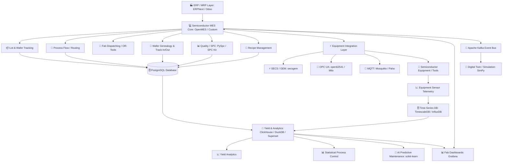

# 🏭 Awesome Semiconductor Manufacturing Execution System (MES)

  

  
  
  
  
  

## 🔬 Top Semiconductor Manufacturing Execution System (MES) Ecosystem

**Curated List of Commercial SaaS/Hosted Platforms & Open-Source GitHub Projects**  
*Focused on Semiconductor MES, Fab Automation, SECS/GEM Equipment Integration, Lot/Wafer Tracking, Wafer Genealogy, Yield Management, Statistical Process Control (SPC), Equipment Connectivity & Smart Semiconductor Manufacturing.*  
📅 **Last updated: September 2026**

---

### 💡 Overview & SEO Guide to Semiconductor MES
This repository tracks key **SaaS/Hosted platforms** and **open-source software projects** powering modern **Semiconductor Manufacturing Execution Systems (MES)**. Semiconductor MES platforms form the digital backbone of front-end wafer fabrication (Fab) and back-end assembly/test (OSAT) facilities. They manage real-time production execution, lot and wafer tracking, process routing, recipe management, SECS/GEM equipment integration, material handling (FOUP/carrier tracking), unit genealogy, defect management, SPC control charts, yield analytics, and factory digital twin simulation.

**Leading Industry Examples** include Siemens Opcenter Execution Semiconductor, Camstar MES, Critical Manufacturing MES, Applied Materials SmartFactory, ABB Ability MES, GE Vernova Proficy MES, Rockwell Automation FactoryTalk ProductionCentre/MES, Parsec TrakSYS, 42Q, FORCAM FORCE MES, and SAP Digital Manufacturing.

**Open-Source & Hybrid Architectures**: The open-source semiconductor-MES ecosystem is growing. Developing a semiconductor-ready MES using open-source components typically involves combining a robust open-source MES/ERP core with **SECS/GEM equipment connectivity + industrial IoT protocols (OPC UA, MQTT) + high-throughput time-series databases + SPC/yield analytics + AI scheduling engines**.

> 📌 **Important Note:** Generic open-source MES platforms (such as **OpenMES, qcadoo MES, ERPNext, Odoo Community, and WebErpMesv2**) provide solid ISA-95 level 3 foundations, but require custom semiconductor-specific protocol integration (SECS/GEM, GEM300, EDA/Interface A) and wafer genealogy modeling to fully replicate tier-1 commercial fab MES suites.

---

## 📌 Table of Contents
* 🌐 [SaaS/Hosted Platforms](#-saashosted-platforms)
* 💻 [Open-Source GitHub Projects (Ranked by Stars)](#-open-source-github-projects-ranked-by-stars)
* ⚡ [Open-Source Equipment Connectivity & SECS/GEM](#-open-source-equipment-connectivity--secsgem)
* 📊 [Open-Source SPC, Quality & Yield Analytics](#-open-source-spc-quality--yield-analytics)
* 🔀 [Commercial MES → Open-Source Building Block Mapping](#-commercial-mes--open-source-building-block-mapping)
* 🏗️ [Frameworks for Building Custom Semiconductor MES](#-frameworks-for-building-custom-semiconductor-mes)
* 📐 [Reference Semiconductor MES Architecture](#-reference-semiconductor-mes-architecture)
* 🔄 [Typical Semiconductor MES Workflow](#-typical-semiconductor-mes-workflow)
* 📈 [Star History](#-star-history)
* 🤝 [How to Contribute](#-how-to-contribute)
* ⚠️ [Disclaimer](#%EF%B8%8F-disclaimer)

---

## 🌐 SaaS/Hosted Platforms

> 📊 **Market Size & Industry Concentration Note:**  
> The global Semiconductor Manufacturing Execution System (MES) market is estimated at **$3.5 Billion in 2026** and projected to reach **$6.8 Billion by 2032** (CAGR ~11.5%). The sector is **highly concentrated** among tier-1 industrial software giants (Siemens, Applied Materials, Critical Manufacturing, SAP, Honeywell, Rockwell) due to steep technological barriers, mission-critical 24/7 fab reliability mandates, and complex SECS/GEM/GEM300 equipment connectivity requirements.

| Platform Name | Capabilities & Description | Company Size (Rev / Valuation) | Starting Pricing | Free Tier / Trial Limits |
| :--- | :--- | :--- | :--- | :--- |
| **Siemens Opcenter Execution Semiconductor** | Semiconductor-specific MES covering production execution, throughput, yield, cost, equipment connectivity, quality, traceability, scheduling and digital-twin-enabled optimization. ([Siemens][1]) | **~$85B Revenue** (Siemens AG) | Starts at $1,000/mo (entry cloud modules); $75,000/yr enterprise base | 30-day free trial via Siemens Opcenter preconfigured cloud sandbox environment |
| **Siemens Opcenter Execution / Camstar** | Enterprise MES platform with strong semiconductor, electronics and discrete-manufacturing capabilities, including manufacturing workflows, genealogy, quality and production management. | **~$85B Revenue** (Siemens AG) | Starts at $1,000/mo (scheduling/execution modules); $50,000/yr enterprise base | 30-day free trial for Opcenter Scheduling Standard cloud sandbox |
| **Honeywell Manufacturing Execution Systems** | Industrial manufacturing execution and process-management technologies supporting production, quality, process control and operational data. | **~$38B Revenue** (Honeywell) | Starts at $2,500/mo per plant site subscription tier ($40,000/yr base) | 30-day evaluation trial in Honeywell Experion/MES cloud sandbox |
| **Honeywell Momentum** | Manufacturing operations/MES technology supporting production and operational execution in industrial environments. | **~$38B Revenue** (Honeywell) | Starts at $2,000/mo subscription tier ($24,000/yr base platform) | 30-day guided cloud trial environment with pre-built data pipelines |
| **SAP Digital Manufacturing** | Cloud manufacturing execution and operations platform connecting ERP, production processes, shop-floor data, quality and analytics. | **~$35B Revenue** (SAP SE) | Starts at $105/resource/mo (Entry tier starting at 30 resources; ~$3,150/mo base) | 30-day test tenant subscription via SAP Store evaluation sandbox |
| **GE Vernova Proficy MES** | Enterprise manufacturing execution platform covering production management, quality, performance, traceability, workflow and plant-floor integration. | **~$33B Revenue** (GE Vernova) | Starts at $1,500/mo subscription tier ($5,000 base module license) | 30-day evaluation trial with 2-hour continuous runtime demo resets |
| **ABB Ability MES** | Manufacturing execution and production-management capabilities integrated into ABB's industrial digitalization ecosystem. | **~$32B Revenue** (ABB Ltd) | Starts at $1,500/mo for entry plant subscriptions on ABB Ability Marketplace | 30-day free trial on selected ABB Ability Marketplace condition-monitoring modules |
| **Applied Materials SmartFactory** | Semiconductor-factory automation and manufacturing intelligence ecosystem integrating equipment, factory data, process control, analytics and production optimization. | **~$26.5B Revenue** (Applied Materials) | Starts at $5,000/mo (process control/analytics); $100,000/yr enterprise suite | 30-day guided POC cloud trial environment for enterprise evaluations |
| **Rockwell Automation FactoryTalk ProductionCentre / MES** | Manufacturing execution and production-management ecosystem integrated with Rockwell Automation's FactoryTalk and industrial automation portfolio. | **~$9B Revenue** (Rockwell Automation) | Starts at $2,000/mo subscription tier ($15,000 base server + $250/user/mo) | 30-day hands-on lab environment trial via Rockwell Cloud Demo Portal |
| **42Q** | Cloud-native manufacturing execution and manufacturing-data platform designed for connected manufacturing operations and distributed production environments. | **~$8.9B Revenue** (Sanmina Parent) | Starts at $500/mo per facility ($1,500/mo standard multi-line tier) | 90-day fixed-cost Proof of Concept (POC) trial (includes 30-day free sandbox) |
| **Dassault Systèmes DELMIA Apriso** | Global manufacturing operations management/MES platform covering production, quality, warehouse, maintenance and supply-chain execution. | **~$6.2B Revenue** (Dassault Systèmes) | Starts at $3,500/mo per plant subscription ($50,000/yr base MOM license) | 30-day virtual sandbox trial access for enterprise evaluation teams |
| **Critical Manufacturing MES** | Modern MES platform with a strong focus on semiconductor and electronics manufacturing, equipment integration, production tracking, genealogy, quality, scheduling and Industry 4.0. | **~$2.8B Revenue** (ASMI Parent / ~$300M standalone) | Starts at $2,500/mo per line (ScaleUp subscription program); $60,000/yr base | 30-day evaluation trial via Early Adopter sandbox program |
| **Körber Werum PAS-X** | Manufacturing execution platform widely used in regulated manufacturing and increasingly relevant to complex production traceability and electronic batch/process execution. | **~$1.6B Revenue** (Körber Group) | Starts at $4,000/mo for cloud-based PAS-X Lite starting tier ($60,000/yr base) | 30-day preconfigured cloud sandbox trial for batch/recipe execution |
| **AVEVA Manufacturing Execution System** | MES/MOM capabilities integrating production execution, operations, quality, performance and industrial data. | **~$1.5B Revenue** (AVEVA Unit / Schneider) | Starts at $1,800/mo via AVEVA Flex subscription units ($25,000/yr base) | 30-day evaluation trial with sample project templates in AVEVA Connect |
| **FORCAM FORCE MES** | Manufacturing execution and performance-management platform focused on shop-floor transparency, OEE, production performance, machine connectivity and continuous improvement. | **~$45M Revenue** / ~$150M Val | Starts at $1,200/mo per plant connector package ($15,000/yr platform base) | 30-day guided cloud evaluation trial for plant connectivity & OEE |
| **Parsec TrakSYS** | Manufacturing operations management/MES platform covering production, quality, performance, downtime, traceability and plant-floor data collection. | **~$35M Revenue** / ~$400M Val | Starts at $1,999/mo (Essentials tier; up to $15,999+/mo Ultimate tier) | 14-day interactive sandbox trial with pre-loaded sample plant datasets |

---

## 💻 Open-Source GitHub Projects (Ranked by Stars)

Below is the complete index of open-source MES, ERP/MRP, semiconductor connectivity, IoT, SPC, scheduling, and analytics projects, **sorted in descending order by GitHub star count**.

* **[Grafana](https://github.com/grafana/grafana)**  — Open-source visualization platform for fab dashboards, OEE, equipment KPIs, yield, SPC, WIP and cycle time tracking.
* **[Apache Superset](https://github.com/apache/superset)**  — Enterprise business intelligence & data exploration platform for semiconductor manufacturing datasets.
* **[scikit-learn](https://github.com/scikit-learn/scikit-learn)**  — Machine learning library for yield prediction, wafer defect classification, process anomaly detection and predictive maintenance.
* **[MinIO](https://github.com/minio/minio)**  — High-performance S3-compatible object storage for storing wafer maps, inspection images, equipment log files, and ML datasets.
* **[Odoo Community](https://github.com/odoo/odoo)**  — Open-source ERP platform providing manufacturing work orders, BOMs, routings, maintenance, and production foundations.
* **[ClickHouse](https://github.com/ClickHouse/ClickHouse)**  — Columnar analytical database for real-time manufacturing analytics, wafer histories, and process parameter mining.
* **[DuckDB](https://github.com/duckdb/duckdb)**  — In-process analytical database for fast local process analytics and engineering work on wafer datasets.
* **[ERPNext](https://github.com/frappe/erpnext)**  — Open-source ERP with manufacturing work orders, BOM management, capacity planning, material consumption, and inventory control.
* **[Apache Kafka](https://github.com/apache/kafka)**  — Event-streaming platform for real-time equipment events, SECS/GEM messages, MES events, and factory telemetry.
* **[InfluxDB](https://github.com/influxdata/influxdb)**  — Time-series database optimized for high-volume semiconductor equipment sensor data.
* **[Node-RED](https://github.com/node-red/node-red)**  — Low-code visual programming tool for industrial IoT data flows, MQTT/OPC UA transformation, and custom shop-floor logic.
* **[TimescaleDB](https://github.com/timescale/timescaledb)**  — Time-series database built on PostgreSQL for equipment telemetry, process parameters, and historical SPC tracking.
* **[PostgreSQL](https://github.com/postgres/postgres)**  — Powerful relational database powering transactional lot/wafer tracking, routing, recipes, genealogy, and quality audit trails.
* **[SciPy](https://github.com/scipy/scipy)**  — Scientific computing library for custom process modeling, engineering calculations, and signal processing.
* **[Google OR-Tools](https://github.com/google/or-tools)**  — Advanced constraint programming and optimization engine for complex fab lot scheduling and dispatching algorithms.
* **[statsmodels](https://github.com/statsmodels/statsmodels)**  — Statistical modeling library for process capability, regression, time-series analysis, and yield modeling.
* **[Eclipse Mosquitto](https://github.com/eclipse-mosquitto/mosquitto)**  — Lightweight MQTT message broker suitable for shop-floor machine telemetry.
* **[Dolibarr ERP CRM](https://github.com/dolibarr/dolibarr)**  — Open-source ERP/CRM suite with basic production and inventory management modules.
* **[open62541](https://github.com/open62541/open62541)**  — C-based open-source OPC UA implementation for embedded industrial gateways and tool automation interfaces.
* **[Pyomo](https://github.com/Pyomo/pyomo)**  — Python-based mathematical optimization modeling language for production planning and resource allocation.
* **[PuLP](https://github.com/coin-or/pulp)**  — Linear programming solver interface used in production optimization models.
* **[Eclipse Paho MQTT](https://github.com/eclipse-paho/paho.mqtt.python)**  — Open-source MQTT client libraries for machine telemetry and factory IoT connectivity.
* **[Timefold / OptaPlanner](https://github.com/timefoldai/timefold-solver)**  — AI constraint solver for production scheduling, capacity planning, and shift management.
* **[EdgeX Foundry](https://github.com/edgexfoundry/edgex-go)**  — Open-source microservice edge computing platform for industrial device connectivity.
* **[Eclipse Milo](https://github.com/eclipse-milo/milo)**  — Java implementation of OPC UA for integrating MES with PLCs, SCADA, and factory equipment.
* **[Apache OFBiz](https://github.com/apache/ofbiz-framework)**  — Enterprise application framework providing core manufacturing ERP and inventory modules.
* **[qcadoo MES](https://github.com/qcadoo/MES)**  — Mature open-source MES platform with manufacturing planning and execution capabilities (AGPLv3).
* **[Eclipse Ditto](https://github.com/eclipse-ditto/ditto)**  — Open-source digital twin framework for managing digital representations of fab equipment and sensors.
* **[iDempiere](https://github.com/idempiere/idempiere)**  — Community-driven open-source ERP platform supporting manufacturing execution extensions.
* **[Eclipse Kura](https://github.com/eclipse-kura/kura)**  — IoT gateway framework for edge hardware connecting equipment protocols to cloud/MES layers.
* **[Eclipse Hono](https://github.com/eclipse-hono/hono)**  — Remote device connectivity platform receiving data from industrial IoT devices.
* **[salabim](https://github.com/salabim/salabim)**  — Discrete-event simulation and visualization library in Python for fab line modeling.
* **[OCA Manufacturing](https://github.com/OCA/manufacture)**  — Community collection of Odoo manufacturing extensions covering MRP and production operations (AGPL-3.0).
* **[secsgem](https://github.com/bparzella/secsgem)**  — Open-source Python library implementing SECS-I, SECS-II, and GEM (SEMI E4/E5/E30) equipment communication.
* **[PySpc](https://github.com/carlosqsilva/pyspc)**  — Python Statistical Process Control (SPC) library supporting X-bar, R, S, EWMA, CUSUM, and p/np control charts.
* **[WebErpMesv2](https://github.com/SMEWebify/WebErpMesv2)**  — Open-source shop-floor manufacturing execution and resource planning system.
* **[OpenMES](https://github.com/Mes-Open/OpenMes)**  — Self-hosted ISA-95 aligned open-source MES with production planning, work orders, quality checks, and MQTT support.
* **[SPC Kit](https://github.com/jchester/spc-kit)**  — SQL/PostgreSQL implementation of Statistical Process Control calculations for direct database integration.
* **[SimPy](https://github.com/simpx/simpy)**  — Process-based discrete-event simulation framework for semiconductor fab capacity and bottleneck modeling.
* **[Cassini](https://github.com/saturnis-io/cassini)**  — Manufacturing quality monitoring platform for real-time control charts, Gauge R&R, and capability analysis.
* **[Salbotics SSD-Line MES](https://github.com/SaladinIART/salbotics-ssd-mes)**  — Open-source reference mini-MES in C#/.NET with track-in/out, genealogy, yield analytics, and SQL storage.
* **[mfgQC](https://github.com/cjbrant/mfgQC)**  — Toolkit for manufacturing quality control, process capability indices (Cp, Cpk), and run rules.

---

## ⚡ Open-Source Equipment Connectivity & SECS/GEM

A fundamental differentiator of semiconductor MES is **direct tool/equipment connectivity**. Fab tools communicate via SEMI standards (SECS/GEM, GEM300, EDA/Interface A) alongside industrial protocols (OPC UA, MQTT).

| Project | Stars | Focus / SEMI Protocol Support | License |
| :--- | :--- | :--- | :--- |
| **[open62541](https://github.com/open62541/open62541)** |  | C library for OPC UA equipment connectivity | MPL-2.0 |
| **[Eclipse Milo](https://github.com/eclipse-milo/milo)** |  | Java OPC UA stack for industrial automation | EPL-2.0 / EDL-1.0 |
| **[Eclipse Paho MQTT](https://github.com/eclipse-paho/paho.mqtt.python)** |  | Python/C MQTT client for telemetry stream | EPL-2.0 / EDL-1.0 |
| **[secsgem](https://github.com/bparzella/secsgem)** |  | Python SEMI E4 (SECS-I), E5 (SECS-II), E30 (GEM) stack | MIT |

---

## 📊 Open-Source SPC, Quality & Yield Analytics

Semiconductor manufacturing demands rigorous **Statistical Process Control (SPC)** and yield engineering.

| Tool | Stars | SPC / Analytics Capability | Primary Language |
| :--- | :--- | :--- | :--- |
| **[scikit-learn](https://github.com/scikit-learn/scikit-learn)** |  | Yield prediction & anomaly detection models | Python |
| **[SciPy](https://github.com/scipy/scipy)** |  | Signal processing & mathematical optimization | Python |
| **[statsmodels](https://github.com/statsmodels/statsmodels)** |  | Statistical regression & process capability | Python |
| **[PySpc](https://github.com/carlosqsilva/pyspc)** |  | Control charts (X-bar, EWMA, CUSUM, p/np) | Python |
| **[SPC Kit](https://github.com/jchester/spc-kit)** |  | In-database PostgreSQL SPC calculation engine | SQL |
| **[Cassini](https://github.com/saturnis-io/cassini)** |  | Real-time control charts, Gauge R&R, Cpk analysis | JavaScript / Web |
| **[mfgQC](https://github.com/cjbrant/mfgQC)** |  | Process capability & run rules toolkit | Python |

---

## 🔀 Commercial MES → Open-Source Building Block Mapping

| Commercial Platform | Primary Focus | Strong Open-Source Building Blocks |
| :--- | :--- | :--- |
| **Siemens Opcenter Execution Semiconductor** | Fab MES + SECS/GEM + Yield + Genealogy | OpenMES + secsgem + OPC UA + Kafka + PostgreSQL + PySpc |
| **Camstar MES** | Enterprise MES + Genealogy + Workflow | OpenMES + PostgreSQL + secsgem + OCA Manufacturing |
| **Critical Manufacturing MES** | Modern Fab MES + Industry 4.0 | OpenMES + Eclipse Hono + OPC UA + Kafka + Grafana |
| **Applied Materials SmartFactory** | Fab Automation + APC/FDC Intelligence | OpenMES + EdgeX + Kafka + TimescaleDB + Grafana |
| **ABB Ability MES** | MOM & Industrial Telemetry | OpenMES + EdgeX + OPC UA + Kafka |
| **GE Proficy MES** | Quality + Production Operations | OpenMES + qcadoo + PostgreSQL + Grafana |
| **Rockwell FactoryTalk MES** | Automation & Shop-Floor Execution | OpenMES + Odoo/ERPNext + Node-RED + OPC UA |
| **Parsec TrakSYS** | OEE + Downtime + Operations | OpenMES + PostgreSQL + Grafana + Node-RED |
| **42Q** | Cloud-Native MES | OpenMES + Kafka + PostgreSQL + Kubernetes |
| **FORCAM FORCE MES** | Machine Connectivity & OEE | OpenMES + TimescaleDB + Grafana + MQTT |
| **Werum PAS-X** | Batch Execution & Traceability | OpenMES + ERPNext + PostgreSQL + Workflow engine |
| **DELMIA Apriso** | Global MOM & Supply Execution | OpenMES + ERPNext + Kafka + Kubernetes |
| **AVEVA MES** | Industrial Telemetry & MOM | OpenMES + EdgeX + InfluxDB + Grafana |

---

## 🏗️ Frameworks for Building Custom Semiconductor MES

| Layer | Recommended Open-Source Stack |
| :--- | :--- |
| **ERP / MRP** | ERPNext · Odoo · iDempiere · Dolibarr |
| **MES Core** | OpenMES · qcadoo MES · Custom .NET/Python Core |
| **Semiconductor Reference** | Salbotics SSD-Line MES |
| **Equipment Connectivity** | secsgem · open62541 · Eclipse Milo |
| **SECS / GEM Protocol** | secsgem (Python) |
| **OPC UA Protocol** | open62541 (C) · Eclipse Milo (Java) |
| **MQTT Protocol** | Eclipse Mosquitto · Eclipse Paho |
| **Industrial Edge** | EdgeX Foundry · Eclipse Kura |
| **Workflow Engine** | Node-RED · Temporal · Camunda |
| **Event Streaming** | Apache Kafka |
| **Transactional DB** | PostgreSQL |
| **Time-Series DB** | TimescaleDB · InfluxDB |
| **Analytics & OLAP** | ClickHouse · DuckDB · Apache Superset |
| **Statistical Process Control** | PySpc · SPC Kit · Cassini · mfgQC |
| **Analytics & Yield ML** | SciPy · statsmodels · scikit-learn |
| **Scheduling Engine** | Google OR-Tools · Timefold / OptaPlanner · Pyomo |
| **Fab Simulation** | SimPy · salabim |
| **Visualization & Dashboards** | Grafana · Apache Superset |
| **Object Storage** | MinIO |

---

## 📐 Reference Semiconductor MES Architecture

---

## 🔄 Typical Semiconductor MES Workflow

---

## 📈 Star History

---

## 🤝 How to Contribute

1. Fork the repository.
2. Edit or add entries in `README.md` following the standard markdown structure.
3. Include: project name, official/GitHub link, star count badge, concise description, and license.
4. Prefer actively maintained projects aligned with semiconductor MES, fab automation, equipment protocols (SECS/GEM, OPC UA, MQTT), or SPC/yield analytics.
5. Avoid presenting generic manufacturing software as feature-complete replacements for semiconductor fab MES without explicit architectural notes.
6. Submit a Pull Request with a clear description of your addition.

---

## ⚠️ Disclaimer

* This repository is a **community-curated index** for informational and educational purposes.
* Trademarks and brand names belong to their respective commercial owners.
* Generic open-source MES/ERP solutions require specialized development to support SECS/GEM, GEM300, wafer tracking, and fab-grade validation.
* Production semiconductor fab environments demand strict cyber-resilience, high availability, change management, and regulatory compliance.

---

[1]: https://www.siemens.com/en-us/products/opcenter/execution/semiconductor/?utm_source=chatgpt.com "Opcenter Execution Semiconductor | Siemens"
[2]: https://github.com/Mes-Open/OpenMes/blob/main/README.md?utm_source=chatgpt.com "OpenMes/README.md at main · Mes-Open/OpenMes · GitHub"

  <b>Built for semiconductor manufacturers, fab engineers, MES architects, equipment engineers, yield teams, and smart manufacturing developers.</b>

